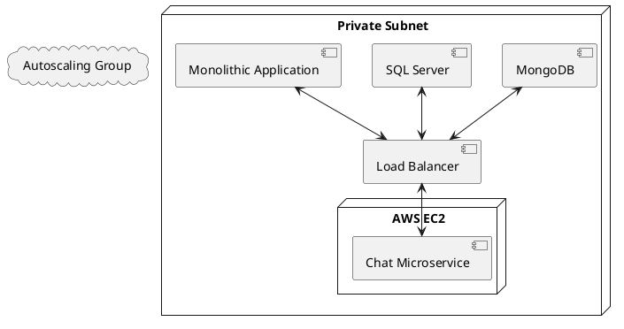

### Diseño de Microservicio de Chats

#### Background

La necesidad de este diseño surge de la demanda de una aplicación de chat escalable y eficiente que permita la creación y gestión de salas de chat y el intercambio de mensajes entre usuarios. Con la escalabilidad en mente, el objetivo es manejar de manera eficiente hasta 2400 usuarios simultáneos. La solución se construirá utilizando el framework ASP.NET 8 y almacenará los mensajes en una base de datos SQL Server. Este microservicio será consumido por un servidor dentro de la misma subred privada que alberga una aplicación monolítica. El objetivo es trasladar la lógica de chats de la aplicación monolítica a un microservicio independiente.

#### Requirements

- El microservicio debe gestionar las salas de chat y los mensajes.
- Cada usuario debe poder participar en múltiples salas de chat simultáneamente.
- La aplicación debe ser capaz de escalar para manejar entre 350 y 2400 usuarios simultáneos.
- Los mensajes de chat deben almacenarse en una base de datos SQL Server.
- Los archivos multimedia deben almacenarse en MongoDB.
- La arquitectura debe ser RESTful para facilitar la integración y la escalabilidad.

#### Método

##### Arquitectura General

La arquitectura del microservicio de chat será diseñada para ser desplegada en un servidor EC2 con Ubuntu 24.01, utilizando autoscaling y load balancing. El microservicio se desplegará en una subred privada, siendo consumido por una aplicación monolítica en el mismo entorno. La inserción de multimedia se gestionará mediante MongoDB.

##### Diagrama de Arquitectura



##### Esquema de la Base de Datos

###### Tabla: `SISTEMAS`

| Columna          | Tipo de Datos            | Descripción                                        |
|------------------|--------------------------|----------------------------------------------------|
| `SISTEMA_ID`     | `UNIQUEIDENTIFIER`       | Identificador único del sistema.                   |
| `NOMBRE_SISTEMA` | `NVARCHAR`               | Nombre del sistema que utiliza la API de chat.     |
| `API_KEY`        | `NVARCHAR`               | Clave API para autenticar solicitudes.             |
| `CREATED_AT`     | `DATETIME`               | Fecha de registro del sistema.                     |
| `ELIMINAR_SALAS` | `BIT`                    | Indica si se pueden eliminar conversaciones.       |
| `ELIMINAR_MENSAJES` | `BIT`                | Indica si se pueden eliminar mensajes.             |
| `ELIMINAR_ARCHIVOS` | `BIT`                | Indica si se pueden eliminar archivos.             |

###### Tabla: `SALAS`

| Columna           | Tipo de Datos            | Descripción                                        |
|-------------------|--------------------------|----------------------------------------------------|
| `SALA_ID`         | `UNIQUEIDENTIFIER`       | Identificador único de la conversación.            |
| `SISTEMA_ID`      | `UNIQUEIDENTIFIER`       | Referencia a la tabla `SISTEMAS`.                  |
| `NOMBRE_SALA`     | `NVARCHAR`               | Tópico o nombre de la conversación.                |
| `DESCRIPCION_SALA`| `NVARCHAR`               | Descripción de la sala.                            |
| `CREATED_AT`      | `DATETIME`               | Fecha de creación de la conversación.              |
| `MODIFIED_AT`     | `DATETIME`               | Fecha de modificación de la conversación.          |
| `USER_CREATED`    | `NVARCHAR`               | Usuario que creó la conversación.                  |
| `USER_MODIFIED`   | `NVARCHAR`               | Usuario que modificó la conversación.              |

###### Tabla: `PARTICIPANTES`

| Columna           | Tipo de Datos            | Descripción                                        |
|-------------------|--------------------------|----------------------------------------------------|
| `PARTICIPANTE_ID` | `UNIQUEIDENTIFIER`       | Identificador único del registro.                  |
| `SALA_ID`         | `UNIQUEIDENTIFIER`       | Referencia a la tabla `SALAS`.                     |
| `USUARIO_SEG_ID`  | `UNIQUEIDENTIFIER`       | Identificador del usuario.                         |
| `FECHA_UNION`     | `DATETIME`               | Fecha en la que el usuario se unió a la conversación. |

###### Tabla: `MENSAJES`

| Columna           | Tipo de Datos            | Descripción                                        |
|-------------------|--------------------------|----------------------------------------------------|
| `MENSAJE_ID`      | `UNIQUEIDENTIFIER`       | Identificador único del mensaje.                   |
| `SALA_ID`         | `UNIQUEIDENTIFIER`       | Referencia a la tabla `SALAS`.                     |
| `USUARIO_SEG_ID`  | `UNIQUEIDENTIFIER`       | Identificador del usuario.                         |
| `MENSAJE`         | `NVARCHAR`               | Contenido del mensaje.                             |
| `CREATED_AT`      | `DATETIME`               | Fecha y hora de envío del mensaje.                 |
| `FILETYPE`        | `NVARCHAR`               | Tipo de archivo, si aplica.                        |

###### Tabla: `MENSAJES_HISTORICOS`

| Columna           | Tipo de Datos            | Descripción                                        |
|-------------------|--------------------------|----------------------------------------------------|
| `MENSAJE_ID`      | `UNIQUEIDENTIFIER`       | Identificador único del mensaje.                   |
| `SALA_ID`         | `UNIQUEIDENTIFIER`       | Referencia a la tabla `SALAS`.                     |
| `USUARIO_SEG_ID`  | `UNIQUEIDENTIFIER`       | Identificador del usuario.                         |
| `MENSAJE`         | `NVARCHAR`               | Contenido del mensaje.                             |
| `CREATED_AT`      | `DATETIME`               | Fecha y hora de envío del mensaje.                 |
| `FILETYPE`        | `NVARCHAR`               | Tipo de archivo, si aplica.                        |

##### Endpoints RESTful

1. **Salas de Chat**
   - `GET /api/chatrooms`: Obtener todas las salas de chat.
   - `POST /api/chatrooms`: Crear nueva sala de chat.
   - `GET /api/chatrooms/{id}`: Obtener detalles de una sala de chat.

2. **Mensajes**
   - `GET /api/chatrooms/{id}/messages`: Obtener todos los mensajes de una sala de chat.
   - `POST /api/chatrooms/{id}/messages`: Enviar un nuevo mensaje en una sala de chat.

3. **Multimedia**
   - `POST /api/chatrooms/{id}/media`: Subir archivo multimedia a una sala de chat.
   - `GET /api/chatrooms/{id}/media/{mediaId}`: Descargar archivo multimedia.

#### Implementación

##### Paso 1: Configuración del Proyecto ASP.NET 8

1. **Crear el Proyecto:**
   - Utiliza el CLI de .NET para crear un nuevo proyecto de API.
     ```bash
     dotnet new webapi -n ChatService
     cd ChatService
     ```

2. **Agregar Paquetes Necesarios:**
   - Asegúrate de instalar los paquetes necesarios para trabajar con SQL Server y SignalR.
     ```bash
     dotnet add package Microsoft.EntityFrameworkCore.SqlServer
     dotnet add package Microsoft.AspNetCore.SignalR
     ```

3. **Configurar la Base de Datos SQL Server:**
   - Configura el contexto de EF Core para la base de datos SQL Server en `Startup.cs` o `Program.cs`.
     ```csharp
     public class ChatContext : DbContext
     {
         public DbSet<Sistema> Sistemas { get; set; }
         public DbSet<Sala> Salas { get; set; }
         public DbSet<Participante> Participantes { get; set; }
         public DbSet<Mensaje> Mensajes { get; set; }
         public DbSet<MensajeHistorico> MensajesHistoricos { get; set; }

         protected override void OnConfiguring(DbContextOptionsBuilder optionsBuilder)
         {
             optionsBuilder.UseSqlServer("YourConnectionStringHere");
         }
     }
     ```

##### Paso 2: Definición de Modelos

Define los modelos de datos en `Models`:

```csharp
public class Sistema
{
    public Guid SistemaId { get; set; }
    public string NombreSistema { get; set; }
    public string ApiKey { get; set; }
    public DateTime CreatedAt { get; set; }
    public bool EliminarSalas { get; set; }
    public bool EliminarMensajes { get; set; }
    public bool EliminarArchivos { get; set; }
}

public class Sala
{
    public Guid SalaId { get; set; }
    public Guid SistemaId { get; set; }
    public string NombreSala { get; set; }
    public string DescripcionSala { get; set; }
    public DateTime CreatedAt { get; set; }
    public DateTime ModifiedAt { get; set; }
    public string UserCreated { get; set; }
    public string UserModified { get; set; }


}

public class Participante
{
    public Guid ParticipanteId { get; set; }
    public Guid SalaId { get; set; }
    public Guid UsuarioSegId { get; set; }
    public DateTime FechaUnion { get; set; }
}

public class Mensaje
{
    public Guid MensajeId { get; set; }
    public Guid SalaId { get; set; }
    public Guid UsuarioSegId { get; set; }
    public string MensajeContenido { get; set; }
    public DateTime CreatedAt { get; set; }
    public string FileType { get; set; }
}

public class MensajeHistorico
{
    public Guid MensajeId { get; set; }
    public Guid SalaId { get; set; }
    public Guid UsuarioSegId { get; set; }
    public string MensajeContenido { get; set; }
    public DateTime CreatedAt { get; set; }
    public string FileType { get; set; }
}
```

##### Paso 3: Configuración de SignalR

1. **Crear el Hub de SignalR:**
   - Define un nuevo hub para manejar las comunicaciones en tiempo real.
     ```csharp
     using Microsoft.AspNetCore.SignalR;
     using System.Threading.Tasks;

     public class ChatHub : Hub
     {
         public async Task SendMessage(Guid salaId, Guid usuarioSegId, string mensaje)
         {
             await Clients.Group(salaId.ToString()).SendAsync("ReceiveMessage", salaId, usuarioSegId, mensaje);
         }

         public async Task JoinRoom(Guid salaId)
         {
             await Groups.AddToGroupAsync(Context.ConnectionId, salaId.ToString());
         }

         public async Task LeaveRoom(Guid salaId)
         {
             await Groups.RemoveFromGroupAsync(Context.ConnectionId, salaId.ToString());
         }
     }
     ```

2. **Configurar SignalR en `Startup.cs` o `Program.cs`:**
   - Configura SignalR en el método `ConfigureServices` y `Configure`.
     ```csharp
     public class Startup
     {
         public void ConfigureServices(IServiceCollection services)
         {
             services.AddControllers();
             services.AddDbContext<ChatContext>();
             services.AddSignalR();
         }

         public void Configure(IApplicationBuilder app, IWebHostEnvironment env)
         {
             if (env.IsDevelopment())
             {
                 app.UseDeveloperExceptionPage();
             }

             app.UseRouting();

             app.UseEndpoints(endpoints =>
             {
                 endpoints.MapControllers();
                 endpoints.MapHub<ChatHub>("/chathub");
             });
         }
     }
     ```

##### Paso 4: Definición de Controladores con Manejo de Códigos de Estado

Crea controladores para gestionar las solicitudes HTTP en `Controllers`:

```csharp
[ApiController]
[Route("api/[controller]")]
public class ChatRoomsController : ControllerBase
{
    private readonly ChatContext _context;

    public ChatRoomsController(ChatContext context)
    {
        _context = context;
    }

    [HttpGet]
    public async Task<ActionResult<IEnumerable<Sala>>> GetChatRooms()
    {
        var chatRooms = await _context.Salas.ToListAsync();
        return Ok(chatRooms);
    }

    [HttpPost]
    public async Task<ActionResult<Sala>> PostChatRoom(Sala chatRoom)
    {
        _context.Salas.Add(chatRoom);
        try
        {
            await _context.SaveChangesAsync();
        }
        catch (DbUpdateException)
        {
            return StatusCode(StatusCodes.Status500InternalServerError, "Error saving data");
        }
        return CreatedAtAction(nameof(GetChatRoom), new { id = chatRoom.SalaId }, chatRoom);
    }

    [HttpGet("{id}")]
    public async Task<ActionResult<Sala>> GetChatRoom(Guid id)
    {
        var chatRoom = await _context.Salas.FindAsync(id);
        if (chatRoom == null)
        {
            return NotFound();
        }
        return Ok(chatRoom);
    }
}

[ApiController]
[Route("api/[controller]")]
public class MessagesController : ControllerBase
{
    private readonly ChatContext _context;
    private readonly IHubContext<ChatHub> _hubContext;

    public MessagesController(ChatContext context, IHubContext<ChatHub> hubContext)
    {
        _context = context;
        _hubContext = hubContext;
    }

    [HttpGet("{roomId}")]
    public async Task<ActionResult<IEnumerable<Mensaje>>> GetMessages(Guid roomId)
    {
        var messages = await _context.Mensajes.Where(m => m.SalaId == roomId).ToListAsync();
        return Ok(messages);
    }

    [HttpPost]
    public async Task<ActionResult<Mensaje>> PostMessage(Mensaje message)
    {
        _context.Mensajes.Add(message);
        try
        {
            await _context.SaveChangesAsync();
            await _hubContext.Clients.Group(message.SalaId.ToString()).SendAsync("ReceiveMessage", message.SalaId, message.UsuarioSegId, message.MensajeContenido);
        }
        catch (DbUpdateException)
        {
            return StatusCode(StatusCodes.Status500InternalServerError, "Error saving data");
        }
        return CreatedAtAction(nameof(GetMessage), new { id = message.MensajeId }, message);
    }

    [HttpGet("{id}")]
    public async Task<ActionResult<Mensaje>> GetMessage(Guid id)
    {
        var message = await _context.Mensajes.FindAsync(id);
        if (message == null)
        {
            return NotFound();
        }
        return Ok(message);
    }
}
```

##### Paso 5: Configuración de AWS

1. **Crear Instancia EC2:**
   - Crea una instancia EC2 con Ubuntu 24.01.
   - Configura las reglas de seguridad para permitir el tráfico en los puertos necesarios (por ejemplo, 80, 443 para HTTP/HTTPS).

2. **Configurar Autoscaling y Load Balancer:**
   - Configura un grupo de Auto Scaling en AWS.
   - Configura un Load Balancer para distribuir el tráfico entre las instancias de EC2.

3. **Despliegue:**
   - Implementa el microservicio en la instancia EC2.
   - Asegúrate de que el servicio se inicie automáticamente al arrancar la instancia.

#### Milestones

1. **Configuración Inicial del Proyecto:** Configurar el proyecto ASP.NET 8 y las dependencias.
2. **Definición de Modelos y Controladores:** Crear los modelos de datos y los controladores para gestionar las solicitudes.
3. **Integración de SignalR:** Configurar SignalR para manejar la comunicación en tiempo real.
4. **Despliegue en AWS:** Configurar y desplegar el microservicio en AWS, incluyendo autoscaling y load balancing.
5. **Pruebas y Validación:** Realizar pruebas para asegurar que el microservicio funcione correctamente y escale según lo esperado.

#### Gathering Results

1. **Pruebas de Carga:** Realizar pruebas de carga para verificar que el microservicio puede manejar hasta 2400 usuarios simultáneos.
2. **Evaluación de Funcionalidades:** Verificar que todas las funcionalidades requeridas (gestión de salas, mensajes y multimedia) funcionen correctamente.
3. **Monitoreo y Optimización:** Monitorear el rendimiento del microservicio y realizar ajustes según sea necesario para mejorar la eficiencia y escalabilidad.
